# Jarkom-Modul-2-B20-2023

## Informasi Kelompok

| Nama | NRP |
| ---- | --- |
| Richie Seputro | 5025211213 |
| Dimas Aria Pujangga | 5025211212 |

## Penjelasan

## Soal 1 
Yudhistira akan digunakan sebagai DNS Master, Werkudara sebagai DNS Slave, Arjuna merupakan Load Balancer yang terdiri dari beberapa Web Server yaitu Prabakusuma, Abimanyu, dan Wisanggeni. Buatlah topologi dengan pembagian sebagai berikut. Folder topologi dapat diakses pada drive berikut

Pertama, buat topologi sesuai yang diminta pada soal.

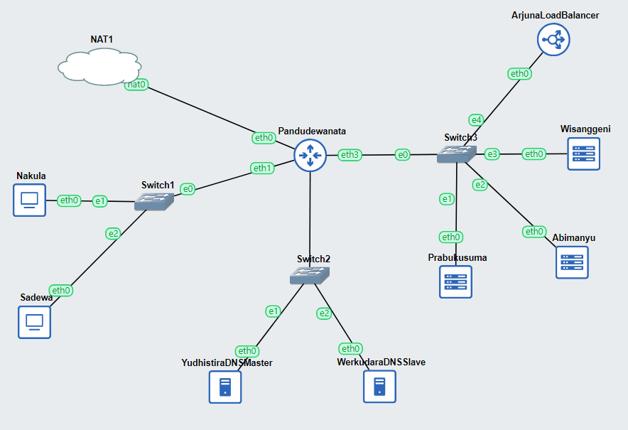

Kemudian kita setting konfigurasi pada Router yaitu Pandudewanata.

```
auto eth0
iface eth0 inet dhcp

auto eth1
iface eth1 inet static
	address 192.188.1.1
	netmask 255.255.255.0

auto eth2
iface eth2 inet static
	address 192.188.2.1
	netmask 255.255.255.0

auto eth3
iface eth3 inet static
	address 192.188.3.1
	netmask 255.255.255.0
```
Setelah itu lakukan testing untuk mengecek apakah sudah terkoneksi dengan internet dengan melakukan `ping` google.com

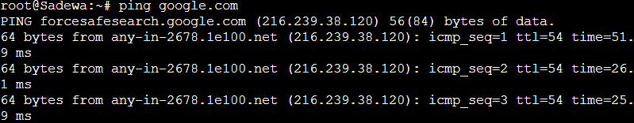

## Soal 2
Buatlah website utama pada node arjuna dengan akses ke arjuna.yyy.com dengan alias www.arjuna.yyy.com dengan yyy merupakan kode kelompok.

Pada node Yudhistira, lakukan perintah berikut:
```
apt-get update
apt-get install bind9 -y
cp -r -f /root/prak1/bind /etc/
service bind9 restart

nano /etc/bind/named.conf.local

zone "arjuna.b20.com" {
    type master;
    file "/etc/bind/jarkom/arjuna.b20.com";
};

mkdir /etc/bind/jarkom

cp /etc/bind/db.local /etc/bind/jarkom/arjuna.b20.com
nano /etc/bind/jarkom/arjuna.b20.com  

(ganti menjadi arjuna.20.com)
((ganti ip (192.188.2.2)))
((Tambahkan www	IN	CNAME	arjuna.b20.com.))

service bind9 restart
```

Kemudian pada node Sadewa, lakukan testing dengan menambahkan `nameserver 192.188.2.2` (IP Yudhistira) kemudian lakukan ping arjuna.b20.com.

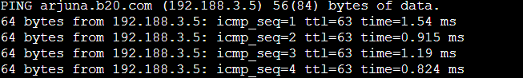

## Soal 3
Dengan cara yang sama seperti soal nomor 2, buatlah website utama dengan akses ke abimanyu.yyy.com dan alias www.abimanyu.yyy.com.

Untuk soal nomor 3, langkah-langkah yang dilakukan sama persis seperti pada soal nomor 2. Hanya saja ganti arjuna.b20.com menjadi abimanyu.b20.com.

```
apt-get update
apt-get install bind9 -y
cp -r -f /root/prak1/bind /etc/
service bind9 restart

nano /etc/bind/named.conf.local

zone "abimanyu.b20.com" {
    type master;
    file "/etc/bind/jarkom/abimanyu.b20.com";
};

mkdir /etc/bind/jarkom

cp /etc/bind/db.local /etc/bind/jarkom/abimanyu.b20.com
nano /etc/bind/jarkom/abimanyu.b20.com  

(ganti menjadi abimanyu.20.com)
((ganti ip (192.188.2.2)))
((Tambahkan www	IN	CNAME	abimanyu.b20.com.))

service bind9 restart
```
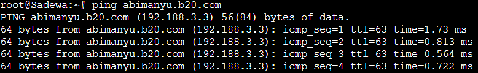

## Soal 4
Kemudian, karena terdapat beberapa web yang harus di-deploy, buatlah subdomain parikesit.abimanyu.yyy.com yang diatur DNS-nya di Yudhistira dan mengarah ke Abimanyu. 

Lakukan perintah berikut pada node Yudhistira

```
nano /etc/bind/jarkom/abimanyu.b20.com

((Tambahkan))
parikesit	IN	A	192.188.3.3
service bind9 restart
```
Kemudian pada node Sadewa, lakukan testing untuk mengecek apakah abimanyu.b21.com atau www.abimanyu.b21.com dapat diakses. Lakukan ping parikesit.abimanyu.b20.com.

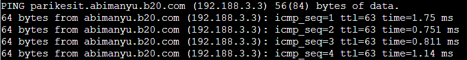

## Soal 5 
Buat juga reverse domain untuk domain utama. (Abimanyu saja yang direverse)

Lakukan perintah ini pada node Yudhistira.
```nano /etc/bind/named.conf.local

zone "3.188.192.in-addr.arpa" {
  type master;
  file "/etc/bind/jarkom/3.188.192.in-addr.arpa";
};

cp /etc/bind/db.local /etc/bind/jarkom/3.188.192.in-addr.arpa

nano /etc/bind/jarkom/3.188.192.in-addr.arpa

((Tambahkan))
3.188.192.in-addr.arpa.	IN	NS	abimanyu.b20.com.
3			            IN	PTR	abimanyu.b20.com.

service bind9 restart
```
Kemudian pada node `Sadewa`, lakukan perintah berikut.
```
// Install package dnsutils, ubah nameserver ke 192.168.122.1
apt-get update
apt-get install dnsutils -y

// Kembalikan nameserver agar tersambung dengan Yudhistira
host -t PTR 192.188.2.2
```
Setelah itu lakukan testing dengan menulis perintah berikut pada node Sadewa.
```
host -t PTR 192.188.3.3
```

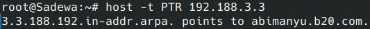


## Soal 6
Agar dapat tetap dihubungi ketika DNS Server Yudhistira bermasalah, buat juga Werkudara sebagai DNS Slave untuk domain utama.

Lakukan perintah berikut pada node Yudhistira
```
nano /etc/bind/named.conf.local

((Pada setiap zone (kecuali reverse), tambahkan))
also-notify { 192.188.2.3; }; // IP Werkudara
allow-transfer { 192.188.2.3; }; // IP Werkudara

service bind9 restart
```
Kemudian pada node Werkudara, lakukan perintah berikut
```
apt-get update
apt-get install bind9 -y
nano /etc/bind/named.conf.local

zone "arjuna.b20.com" {
  type slave;
  masters { 192.188.2.2; };
  file "/var/lib/bind/arjuna.b20.com";
};

zone "abimanyu.b20.com" {
  type slave;
  masters { 192.188.2.2; }; 
  file "/var/lib/bind/abimanyu.b20.com";
};

service bind9 restart
```

Sebelum melakukan testing pada node Sadewa, stop service bind9 terlebih dahulu pada node Yudhistira.
``` 
service bind9 stop
```

Setelah itu lakukan testing pada node Sadewa untuk mengecek apakah DNS Slave berhasil dibuat pada Werkudara.

```
nano /etc/resolv.conf
nameserver 192.188.2.2
nameserver 192.188.2.3

ping www.arjuna.b20.com
ping www.abimanyu.b20.com
```

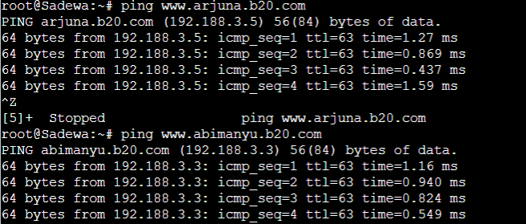

## Soal 7
Seperti yang kita tahu karena banyak sekali informasi yang harus diterima, buatlah subdomain khusus untuk perang yaitu baratayuda.abimanyu.yyy.com dengan alias www.baratayuda.abimanyu.yyy.com yang didelegasikan dari Yudhistira ke Werkudara dengan IP menuju ke Abimanyu dalam folder Baratayuda.

Lakukan perintah berikut pada node `Yudhistira`

```
  nano /etc/bind/jarkom/abimanyu.b20.com

  ((Tambahkan))
  ns1	        IN	A	192.188.2.3
  baratayuda	IN	NS	ns1

  nano /etc/bind/named.conf.options

  comment //dnsec
  allow-query{any;};

  service bind9 restart
```

Pada node `Werkudara`, lakukan perintah berikut.

```
nano /etc/bind/named.conf.options

comment //dnsec
allow-query{any;};

  nano /etc/bind/named.conf.local
  
zone "baratayuda.abimanyu.b20.com" {
  type master;
  file "/etc/bind/delegasi/baratayuda.abimanyu.b20.com";
};

  mkdir /etc/bind/delegasi

cp /etc/bind/db.local /etc/bind/Baratayuda/baratayuda.abimanyu.b20.com

  nano  /etc/bind/delegasi/baratayuda.abimanyu.b20.com

  ((ganti nama menjadi baratayuda.abimanyu.b20.com))
  ((ganti IP abimanyu))
  ((ganti AAAA jadi www	IN	A	192.188.3.3))

  service bind9 restart
```

Pada node Sadewa, lakukan testing untuk mengecek apakah baratayuda.abimanyu.b21.com atau www.baratayuda.abimanyu.b21.com dapat diakses.

```
ping baratayuda.abimanyu.b20.com

ping www.baratayuda.abimanyu.b20.com
```

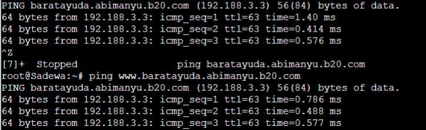

## Soal 8
Untuk informasi yang lebih spesifik mengenai Ranjapan Baratayuda, buatlah subdomain melalui Werkudara dengan akses rjp.baratayuda.abimanyu.yyy.com dengan alias www.rjp.baratayuda.abimanyu.yyy.com yang mengarah ke Abimanyu.

Lakukan perintah berikut pada node Werkudara

```
nano /etc/bind/delegasi/baratayuda.abimanyu.b20.com

((Tambahkan))
rjp	    IN	A	    192.188.3.3
www.rjp	IN	CNAME	rjp.baratayuda.abimanyu.b20.com.

service bind9 restart
```

Pada node Sadewa, lakukan testing untuk mengecek apakah rjp.baratayuda.abimanyu.yyy.com atau www.rjp.baratayuda.abimanyu.yyy.com dapat diakses.

```
ping www.rjp.baratayuda.abimanyu.b20.com
```
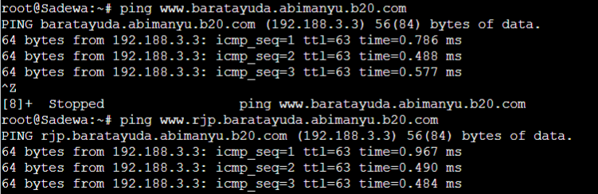

## Soal 9
Arjuna merupakan suatu Load Balancer Nginx dengan tiga worker (yang juga menggunakan nginx sebagai webserver) yaitu Prabakusuma, Abimanyu, dan Wisanggeni. Lakukan deployment pada masing-masing worker.

Lakukan perintah berikut pada node `Pandudewanata`

```
apt-get update
apt-get install nginx -y
service nginx start
```

Lakukan perintah berikut pada node `Yudhistira`

```
apt-get install bind9 nginx -y
service nginx start
```

Lakukan perintah berikut pada node `Prabukusuma/Wisangeni/Abimanyu`

```
apt-get update && apt install nginx php php-fpm -y
mkdir /var/www/jarkom

  nano /var/www/jarkom/index.php
```

```
 <?php
echo "Halo, Kamu berada di Prabukusuma";
 	?>

	<?php
echo "Halo, Kamu berada di Abimanyu";
 	?>

	<?php
echo "Halo, Kamu berada di Wisanggeni";
 	?>
```

```
ln -s /etc/nginx/sites-available/jarkom /etc/nginx/sites-enabled

service nginx start
  service php7.0-fpm start

nginx -t
```

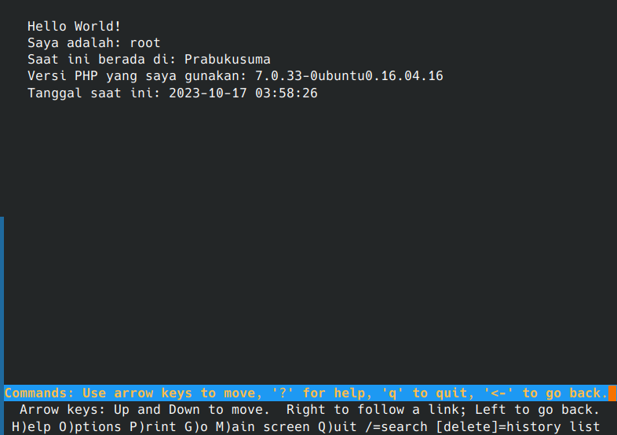

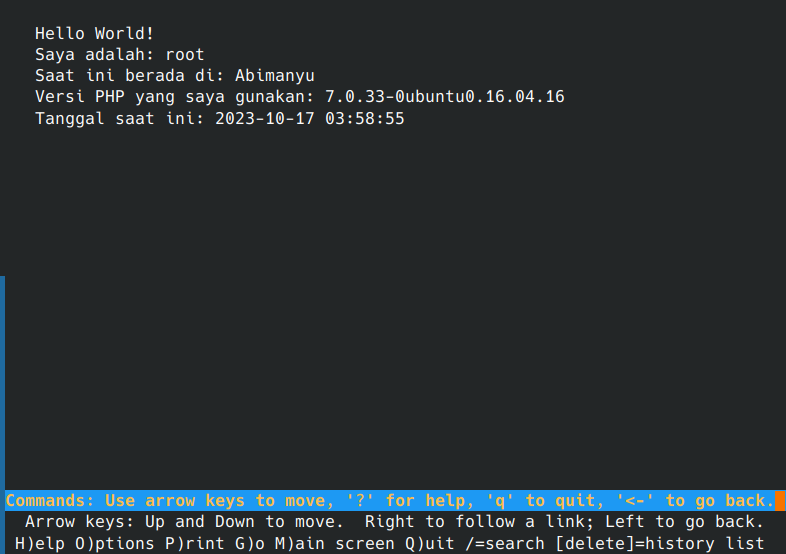


10. Langkah pertama, masuk ke host `Prabukusuma` untuk menyetel setting Nginx dan men-download webpage yang
    akan di-serve kepada client.
    
    Selanjutnya, buka file `/etc/nginx/sites-available/default` dan tuliskan seperti ini:
    
    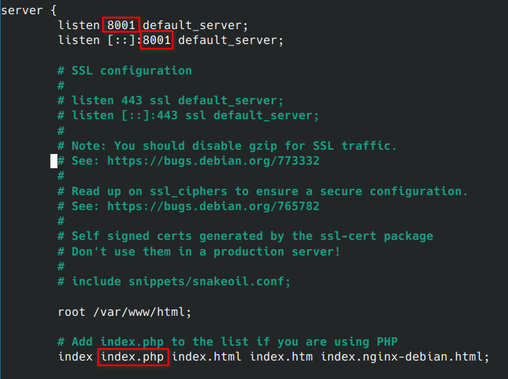
    
    Lalu, buka file `/root/.bashrc` dan tuliskan seperti ini:

    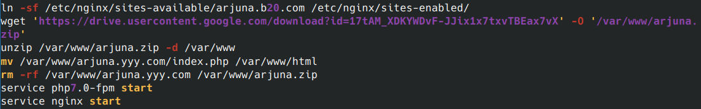
    
    Setelah itu, masuk ke host `Abimanyu` dan `Wisanggeni` dan ulangi langkah-langkah di atas. Ubahlah
    port yang digunakan oleh `Abimanyu` ke `8002` dan `Wisanggeni` ke `8003`. Untuk file `/root/.bashrc`
    tetap sama dengan `Prabukusuma`.
    
    Kemudian, masuk ke host `Arjuna` dan edit file `/etc/nginx/sites-available/arjuna.b20.com` menjadi
    seperti ini:

    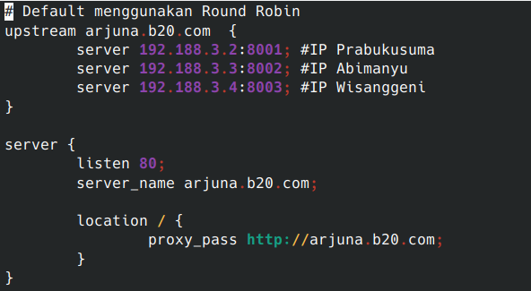
    
    Selanjutnya, tambahkan baris-baris berikut ke file `/root/.bashrc`:

    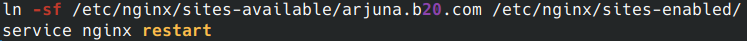
    
    Terakhir, kita masuk ke client host `Sadewa` dan tes website `arjuna.b20.com` dengan `lynx`:

    

    

    
    
    Terlihat bahwa Load Balancer telah berhasil di-setup dan telah membagi load
    secara round-robin antara `Prabukusuma`, `Abimanyu`, dan `Wisanggeni`.

11. Pertama, masuk ke host `Abimanyu` dan edit file `/etc/apache2/sites-available/abimanyu.b20.com.conf`:

    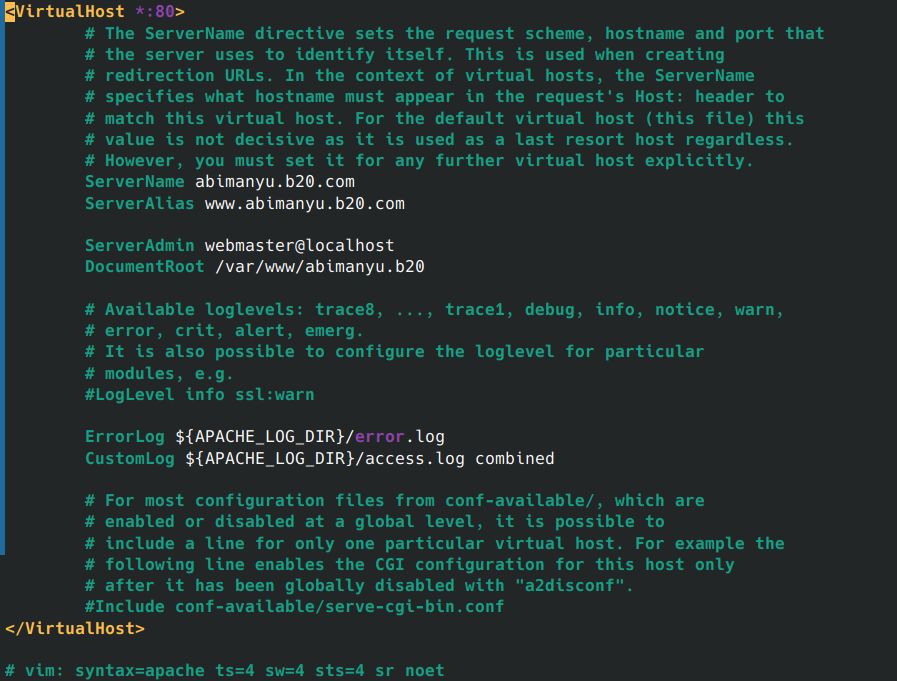
    
    Kemudian, tambahkan baris-baris berikut ke file `/root/.bashrc`:

    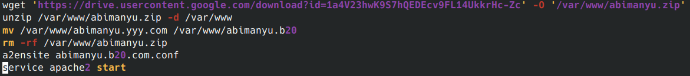
    
    Terakhir, tes website `www.abimanyu.b20.com` dengan `lynx` dari host `Sadewa`:

    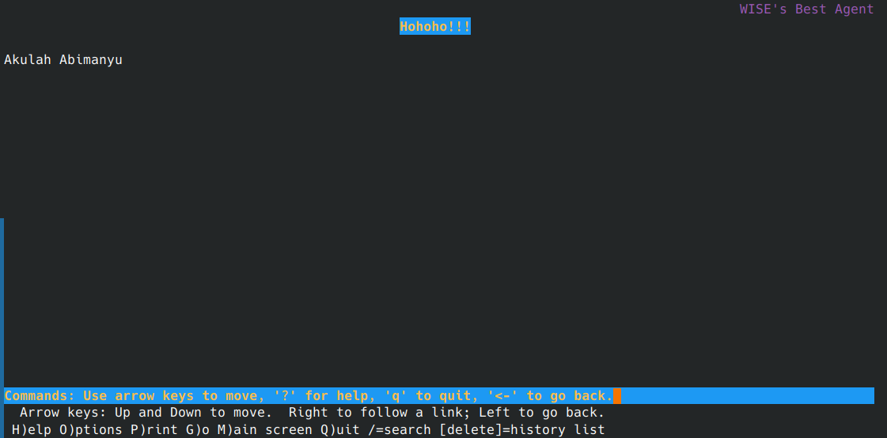
    
    Terlihat bahwa server Apache berhasil melayani request dari client.

12. Pertama, kita coba akses `www.abimanyu.b20.com/home`:

    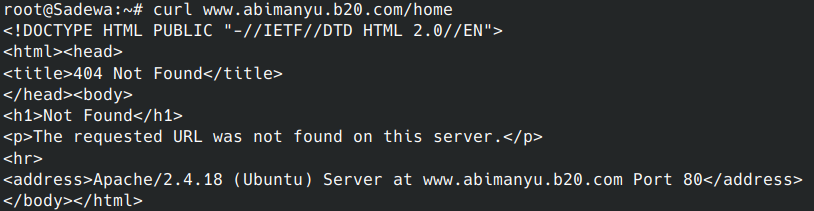
    
    Terlihat bahwa server mengembalikan error code 404 Not Found.

    Kedua, kita tambahkan baris berikut ke file `/etc/apache2/sites-available/abimanyu.b20.com.conf`:

    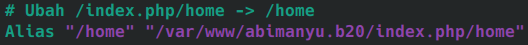
    
    Baris tersebut akan membuat `/home` mengarah ke `/index.php/home`. Setelah me-restart service `apache2`, lakukan pengetesan dari host `Sadewa`:

    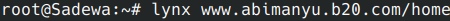
    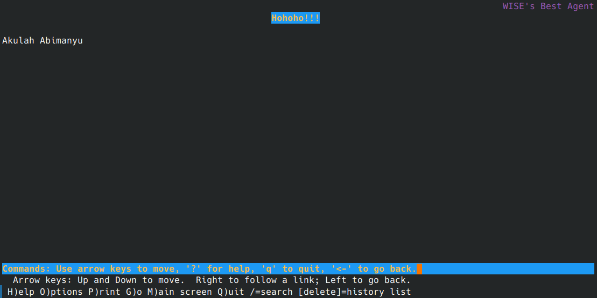
    
    Terlihat bahwa sekarang `/home` sudah menghasilkan sebuah webpage.

13. Pertama, tambahkan file `/etc/apache2/sites-available/parikesit.abimanyu.b20.com.conf`:

    
    
    Kemudian, tambahkan baris-baris berikut ke file `/root/.bashrc`:
    
    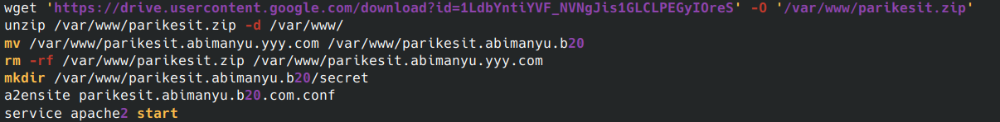
    
    Terakhir, cek apakah website `www.parikesit.abimanyu.b20.com` dapat diakses melalui Lynx dari host `Sadewa`:

    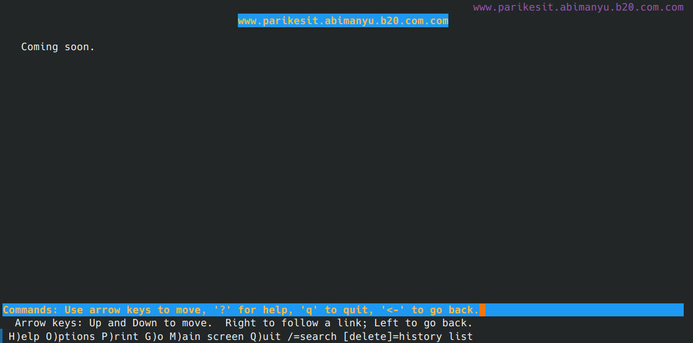
    
    Terlihat bahwa webpage berhasil ditampilkan.

14. Pertama, tambahkan directive-directive berikut ke file `/etc/apache2/sites-available/parikesit.abimanyu.b20.com.conf`:

    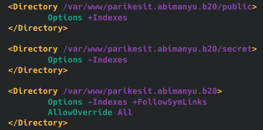
    
    Lalu, kita akan mencoba untuk membuka `/public` menggunakan Lynx:

    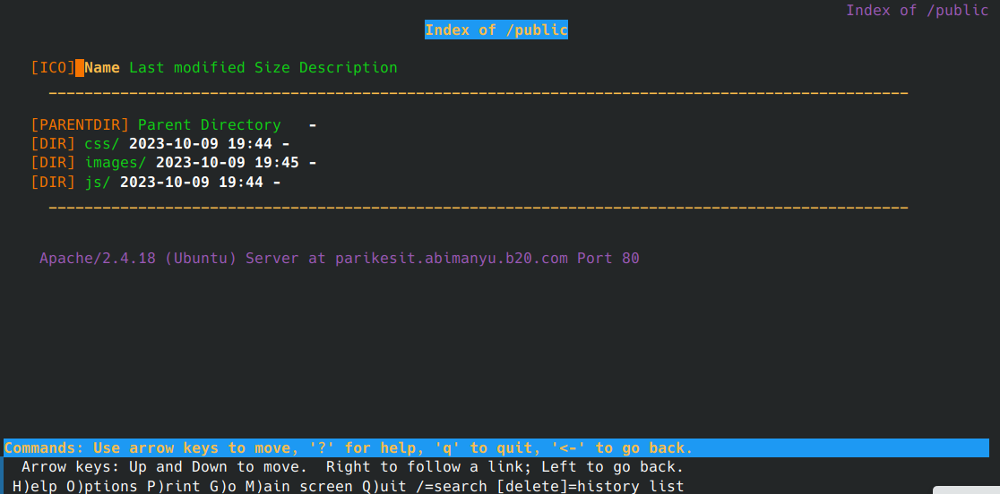
    
    Terlihat bahwa directory listing pad `/public` telah bekerja.
    
    Selanjutnya, kita akan mencoba membuka directory `/secret`:

    
    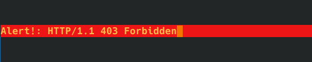
    
    Terlihat bahwa server mengembalikan error code 403 Forbidden.

15. Untuk kustomisasi error page, laman error kustom-nya telah diberikan dari file zip yang disediakan.
    Kita hanya perlu menetapkan kedua file laman error tersebut untuk digunakan ketika terjadi kode error 403 dan 404.
    
    Ubah file `/etc/apache2/sites-available/parikesit.abimanyu.b20.com.conf` dan tambahkan directive-directive berikut:

    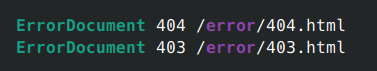
    
    Kemudian cobalah untuk mengakses laman-laman yang tidak ada maupun yang dilarang untuk diakses, contohnya sebagai berikut:

    Kasus kode error 404 Not Found:
    
    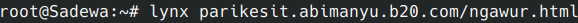
    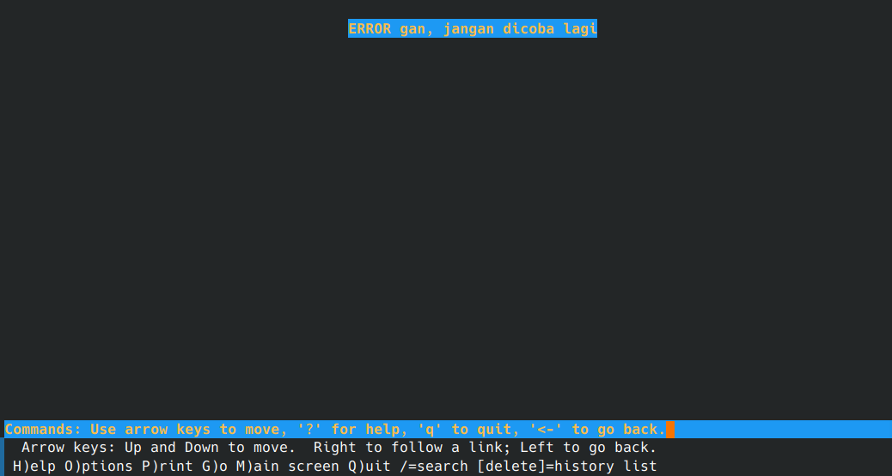

    Kasus kode error 403 Forbidden:
    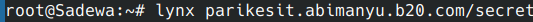
    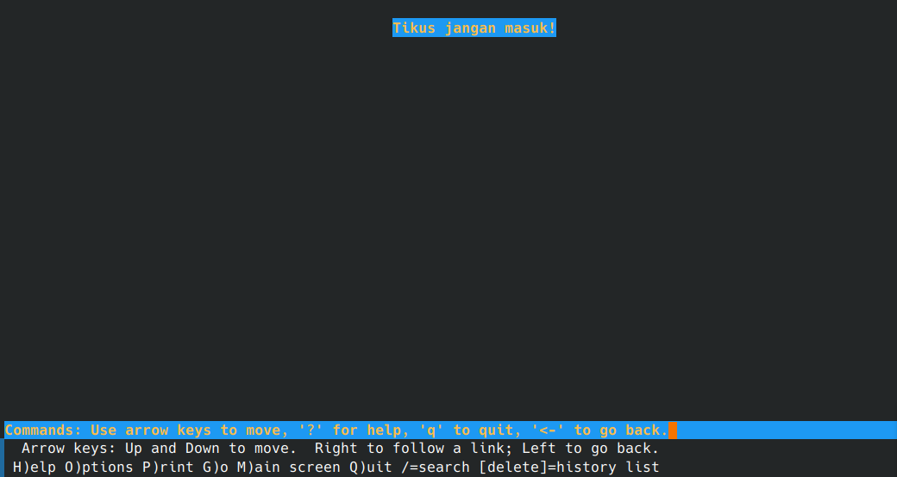

16. Pertama, tambahkan directive berikut ke file `/etc/apache2/sites-available/parikesit.abimanyu.b20.com.conf`:

    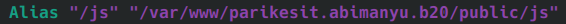
    
    Setelah itu, cek apakah `/js` sudah dapat diakses dan mengarah ke `/public/js` dari client `Sadewa`:

    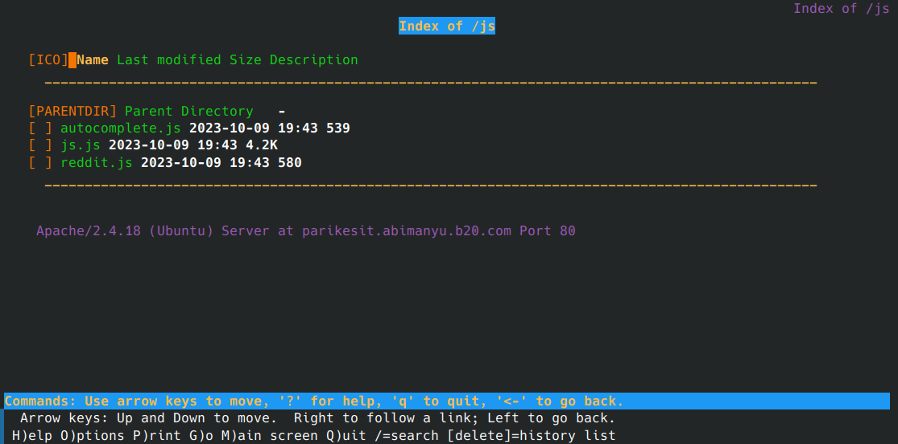
    
    Terlihat bahwa memang benar `/js` sudah menjadi alias `/public/js`.

17. Pertama, tambahkan baris-baris command berikut ke `/root/.bashrc`:

    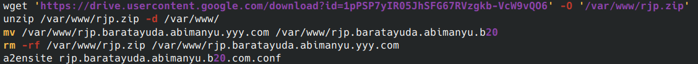

    Selanjutnya, tambahkan file `/etc/apache2/sites-available/rjp.baratayuda.abimanyu.b20.com.conf` yang berisi:

    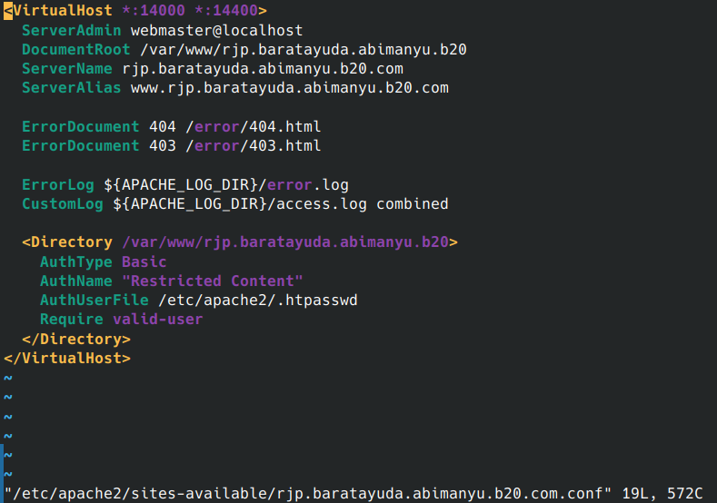
    
    Perhatikan bagian atas. Terdapat pengaturan bahwa VirtualHost akan melakukan listening di port 14000 dan 14400.
    
    Kemudian, jangan lupa untuk menambahkan directive untuk listening di port 14000 dan 14400 ke file `/etc/apache2/ports.conf`:

    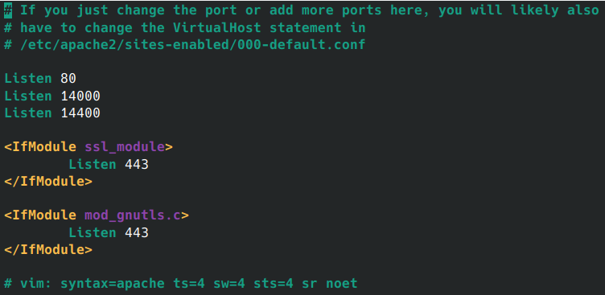
    
    Terakhir, kita akan mengecek dengan cara mengakses `rjp.baratayuda.abimanyu.b20.com` melalui port 80. Seharusnya
    permintaan tersebut tidak akan menampilkan webpage yang sesungguhnya.
    
    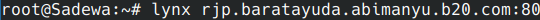
    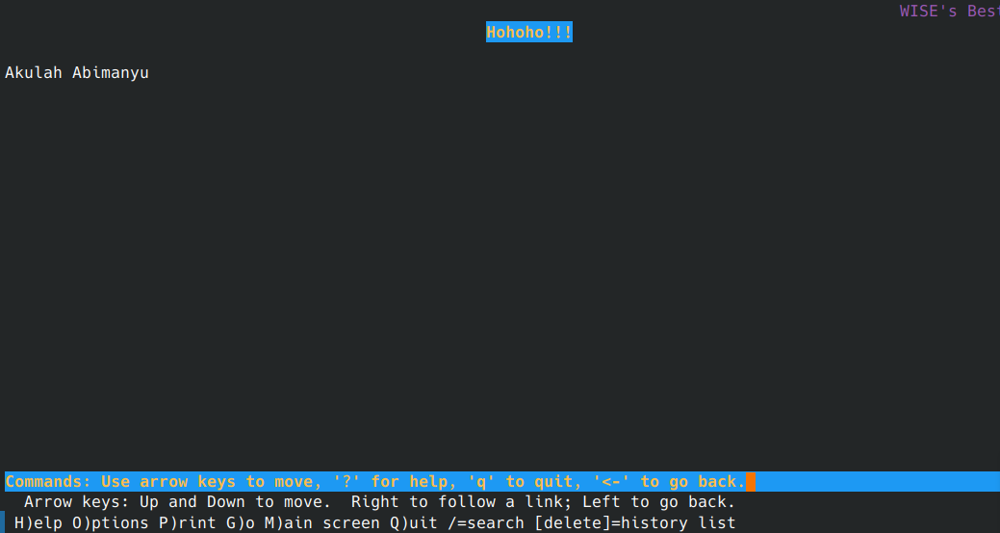
    
    Terlihat bahwa request ke laman yang benar gagal karena server tidak melakukan listening untuk request di port 80
    untuk subdomain `rjp.baratayuda.abimanyu.b20.com`.

    Namun, jika kita coba di port 14000 dan 14400, maka akan tampil laman website-nya:

    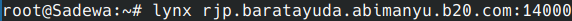
    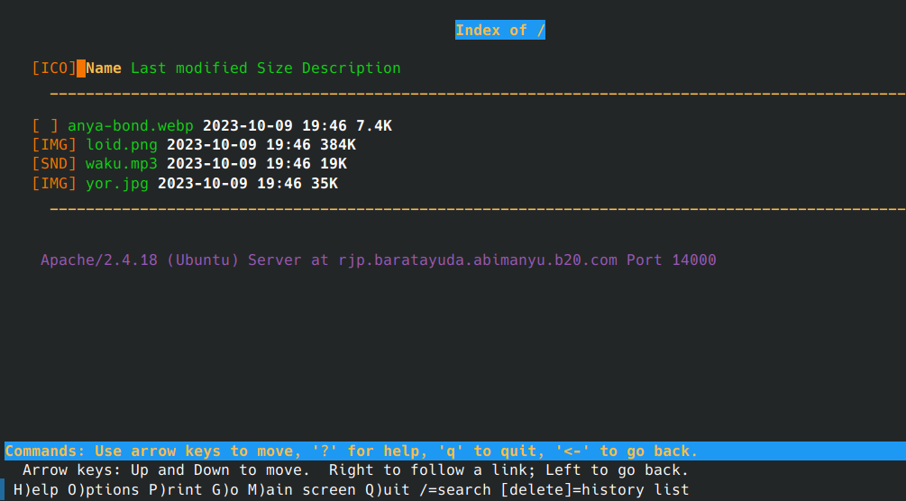

    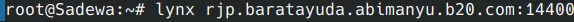
    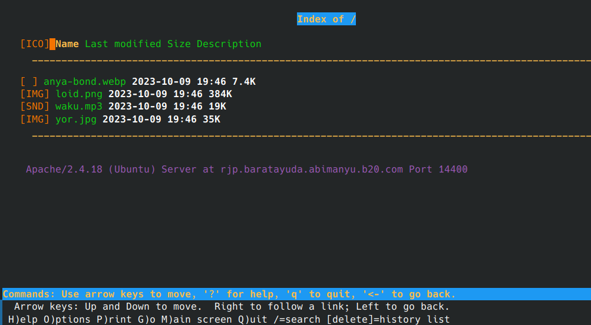

18. Pertama, tambahkan directive berikut ke file `/etc/apache2/sites-available/rjp.baratayuda.abimanyu.b20.com.conf`:

    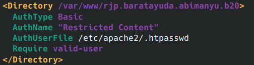
    
    Selanjutnya, tambahkan command berikut ke `/root/.bashrc`:
    
    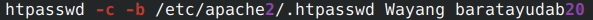
    
    Lalu, kita akan mencoba untuk mengakses laman `rjp.baratayuda.abimanyu.b20.com`:
    
    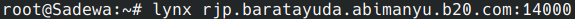
    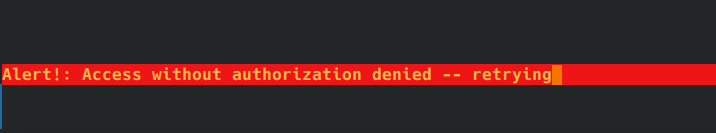
    
    Terlihat bahwa akses tanpa otorisasi ditolak oleh server.
    
    Masukkan username dan password yang telah ditentukan sebelumnya:

    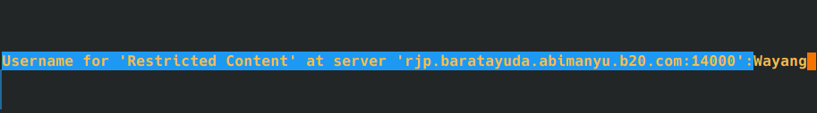
    
    
    Jika kredensial benar, akan tampil laman yang kita inginkan:

    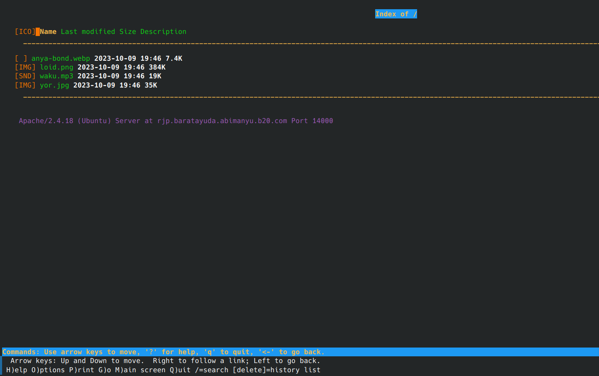

19. Pertama, tambahkan file `/var/www/abimanyu.b20/.htaccess` yang berisikan:

    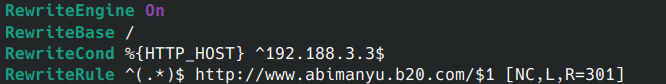
    
    Kemudian, jangan lupa untuk menambahkan directive berikut pada `/etc/apache2/sites-available/abimanyu.b20.com.conf` agar perubahan yang dilakukan dalam file `.htaccess` dapat dijalankan:

    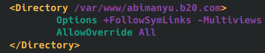

20. Pertama, tambahkan file `/var/www/parikesit.abimanyu.b20/.htaccess` yang berisikan:

    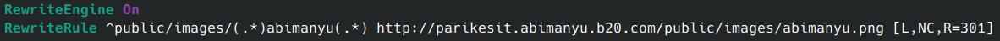

    Kemudian, tambahkan directive berikut ke `/etc/apache2/sites-available/parikesit.abimanyu.b20.com.conf`:

    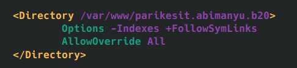
    
    Selanjutnya, kita akan mencoba meng-query gambar yang tidak mengandung substring `abimanyu`.

    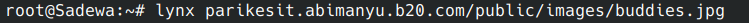
    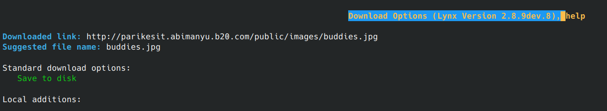
    
    Terlihat bahwa link tetap seperti semula, tidak terjadi redirect apapun.

    Namun, ketika kita mencoba lagi dengan query yang mengandung substring `abimanyu`, maka akan di-redirect ke gambar `abimanyu.png`:
    
    
