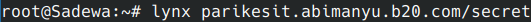
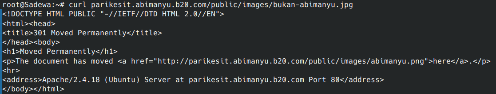

# Jarkom-Modul-1-B20-2023

## Informasi Kelompok

| Nama | NRP |
| ---- | --- |
| Richie Seputro | 5025211213 |
| Dimas Aria Pujangga | 5025211212 |

## Penjelasan

1. Yudhistira akan digunakan sebagai DNS Master, Werkudara sebagai DNS Slave, Arjuna merupakan Load Balancer yang terdiri dari beberapa Web Server yaitu Prabakusuma, Abimanyu, dan Wisanggeni. Buatlah topologi dengan pembagian sebagai berikut. Folder topologi dapat diakses pada drive berikut

Pertama, buat topologi sesuai yang diminta pada soal.

2. Dimas

3. Dimas

4. Dimas

5. Dimas

6. Dimas

7. Dimas

8. Dimas

9. Dimas

10. Langkah pertama, masuk ke host `Prabukusuma` untuk menyetel setting Nginx dan men-download webpage yang
    akan di-serve kepada client.
    
    Selanjutnya, buka file `/etc/nginx/sites-available/default` dan tuliskan seperti ini:
    
    
    
    Lalu, buka file `/root/.bashrc` dan tuliskan seperti ini:

    
    
    Setelah itu, masuk ke host `Abimanyu` dan `Wisanggeni` dan ulangi langkah-langkah di atas. Ubahlah
    port yang digunakan oleh `Abimanyu` ke `8002` dan `Wisanggeni` ke `8003`. Untuk file `/root/.bashrc`
    tetap sama dengan `Prabukusuma`.
    
    Kemudian, masuk ke host `Arjuna` dan edit file `/etc/nginx/sites-available/arjuna.b20.com` menjadi
    seperti ini:

    
    
    Selanjutnya, tambahkan baris-baris berikut ke file `/root/.bashrc`:

    
    
    Terakhir, kita masuk ke client host `Sadewa` dan tes website `arjuna.b20.com` dengan `lynx`:

    

    

    
    
    Terlihat bahwa Load Balancer telah berhasil di-setup dan telah membagi load
    secara round-robin antara `Prabukusuma`, `Abimanyu`, dan `Wisanggeni`.

11. Pertama, masuk ke host `Abimanyu` dan edit file `/etc/apache2/sites-available/abimanyu.b20.com.conf`:

    
    
    Kemudian, tambahkan baris-baris berikut ke file `/root/.bashrc`:

    
    
    Terakhir, tes website `www.abimanyu.b20.com` dengan `lynx` dari host `Sadewa`:

    
    
    Terlihat bahwa server Apache berhasil melayani request dari client.

12. Pertama, kita coba akses `www.abimanyu.b20.com/home`:

    
    
    Terlihat bahwa server mengembalikan error code 404 Not Found.

    Kedua, kita tambahkan baris berikut ke file `/etc/apache2/sites-available/abimanyu.b20.com.conf`:

    
    
    Baris tersebut akan membuat `/home` mengarah ke `/index.php/home`. Setelah me-restart service `apache2`, lakukan pengetesan dari host `Sadewa`:

    
    
    
    Terlihat bahwa sekarang `/home` sudah menghasilkan sebuah webpage.

13. Pertama, tambahkan file `/etc/apache2/sites-available/parikesit.abimanyu.b20.com.conf`:

    
    
    Kemudian, tambahkan baris-baris berikut ke file `/root/.bashrc`:
    
    
    
    Terakhir, cek apakah website `www.parikesit.abimanyu.b20.com` dapat diakses melalui Lynx dari host `Sadewa`:

    
    
    Terlihat bahwa webpage berhasil ditampilkan.

14. Pertama, tambahkan directive-directive berikut ke file `/etc/apache2/sites-available/parikesit.abimanyu.b20.com.conf`:

    
    
    Lalu, kita akan mencoba untuk membuka `/public` menggunakan Lynx:

    
    
    Terlihat bahwa directory listing pad `/public` telah bekerja.
    
    Selanjutnya, kita akan mencoba membuka directory `/secret`:

    
    
    
    Terlihat bahwa server mengembalikan error code 403 Forbidden.

15. Untuk kustomisasi error page, laman error kustom-nya telah diberikan dari file zip yang disediakan.
    Kita hanya perlu menetapkan kedua file laman error tersebut untuk digunakan ketika terjadi kode error 403 dan 404.
    
    Ubah file `/etc/apache2/sites-available/parikesit.abimanyu.b20.com.conf` dan tambahkan directive-directive berikut:

    
    
    Kemudian cobalah untuk mengakses laman-laman yang tidak ada maupun yang dilarang untuk diakses, contohnya sebagai berikut:

    Kasus kode error 404 Not Found:
    
    
    

    Kasus kode error 403 Forbidden:
    
    

16. Pertama, tambahkan directive berikut ke file `/etc/apache2/sites-available/parikesit.abimanyu.b20.com.conf`:

    
    
    Setelah itu, cek apakah `/js` sudah dapat diakses dan mengarah ke `/public/js` dari client `Sadewa`:

    
    
    Terlihat bahwa memang benar `/js` sudah menjadi alias `/public/js`.

17. Pertama, tambahkan baris-baris command berikut ke `/root/.bashrc`:

    

    Selanjutnya, tambahkan file `/etc/apache2/sites-available/rjp.baratayuda.abimanyu.b20.com.conf` yang berisi:

    
    
    Perhatikan bagian atas. Terdapat pengaturan bahwa VirtualHost akan melakukan listening di port 14000 dan 14400.
    
    Kemudian, jangan lupa untuk menambahkan directive untuk listening di port 14000 dan 14400 ke file `/etc/apache2/ports.conf`:

    
    
    Terakhir, kita akan mengecek dengan cara mengakses `rjp.baratayuda.abimanyu.b20.com` melalui port 80. Seharusnya
    permintaan tersebut tidak akan menampilkan webpage yang sesungguhnya.
    
    
    
    
    Terlihat bahwa request ke laman yang benar gagal karena server tidak melakukan listening untuk request di port 80
    untuk subdomain `rjp.baratayuda.abimanyu.b20.com`.

    Namun, jika kita coba di port 14000 dan 14400, maka akan tampil laman website-nya:

    
    

    
    

18. Pertama, tambahkan directive berikut ke file `/etc/apache2/sites-available/rjp.baratayuda.abimanyu.b20.com.conf`:

    
    
    Selanjutnya, tambahkan command berikut ke `/root/.bashrc`:
    
    
    
    Lalu, kita akan mencoba untuk mengakses laman `rjp.baratayuda.abimanyu.b20.com`:
    
    
    
    
    Terlihat bahwa akses tanpa otorisasi ditolak oleh server.
    
    Masukkan username dan password yang telah ditentukan sebelumnya:

    
    
    
    Jika kredensial benar, akan tampil laman yang kita inginkan:

    

19. Pertama, tambahkan file `/var/www/abimanyu.b20/.htaccess` yang berisikan:

    
    
    Kemudian, jangan lupa untuk menambahkan directive berikut pada `/etc/apache2/sites-available/abimanyu.b20.com.conf` agar perubahan yang dilakukan dalam file `.htaccess` dapat dijalankan:

    

20. Pertama, tambahkan file `/var/www/parikesit.abimanyu.b20/.htaccess` yang berisikan:

    

    Kemudian, tambahkan directive berikut ke `/etc/apache2/sites-available/parikesit.abimanyu.b20.com.conf`:

    
    
    Selanjutnya, kita akan mencoba meng-query gambar yang tidak mengandung substring `abimanyu`.

    
    
    
    Terlihat bahwa link tetap seperti semula, tidak terjadi redirect apapun.

    Namun, ketika kita mencoba lagi dengan query yang mengandung substring `abimanyu`, maka akan di-redirect ke gambar `abimanyu.png`:
    
    
